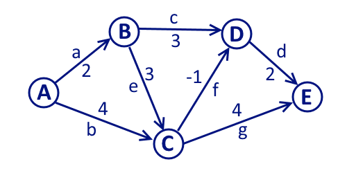

# Projekt Teoria Grafów

Algorytm wczytuje grafy z plików tekstowych, w których zawarta jest lista sąsiedztwa.\
Aby zmienić wczytywany plik, musimy zmienić nazwę pliku w 124 linijce kodu w main.py\
Aby zmienić wierzchołek, z którego startujemy, zmieniamy argument w funkcji bellmanFord w 134 linijce kodu.

Format wprowadzanej listy sąsiedztwa:
>[A => B2 => C4\
> B => D3 => C3\
> C => D-1 => E4\
> D => E2]

Za pomocą takiej listy wczytujemy poniższy graf:
 

Obsługiwany jest również format, w którym w jednym pliku mamy parę list, wtedy musimy oddzielić je przecinkami.
Przykład:
>[[A => B2 => C4\
> B => D3 => C3\
> C => D-1 => E4\
> D => E2],\
> [A => B4 => C2\
> B => C3 => D2 => E3\
> C => B1 => D4 => E5\
> E => D-5]]

Wynikiem działania algorytmu jest tabelka, gdzie d to odległość od wybranego wierzchołka do wierzchołka V, a p to wierzchołek poprzedzający.
>| V | A | B | C | D | E | \
>| d | 0 | 2 | 4 | 3 | 5 | \
>| p | - | A | A | C | D | 

Źródła wykorzystane w części analitycznej:\
https://en.wikipedia.org \
https://eduinf.waw.pl

Szkielety grafów zrealizowane zostały za pomocą strony https://graphonline.ru/en \
Przykładowa topologia sieci zrealizowana została za pomocą symulatora Cisco Packet Tracer.
